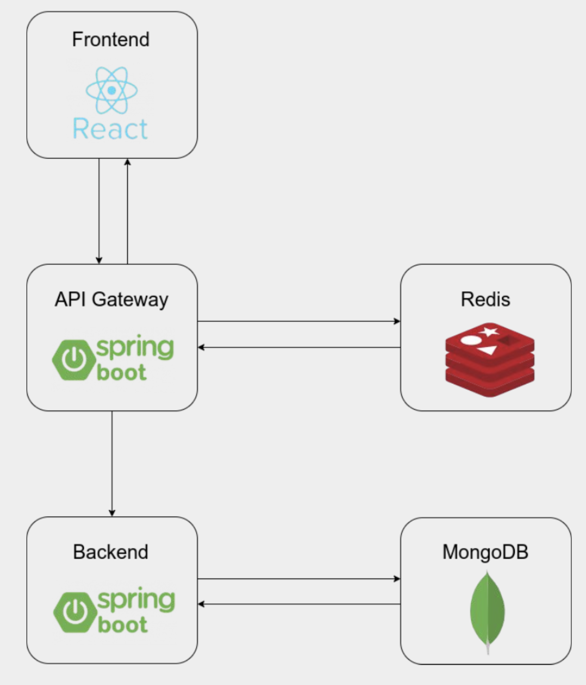

# Kubernetes Features Walkthrough

In this section we will discover the basics of Kubernetes like resource limits, auto scale, rolling update features.

Change your directory to `example-kubernetes-manifests`:

```bash
cd example-kubernetes-manifests
```

## Run a Stateless Application Using a Deployment

You can run an application by creating a Kubernetes Deployment object, and you can describe a Deployment in a YAML file. For example, [this YAML file](./example-kubernetes-manifests/stateless-deployment.yaml) describes a Deployment that runs the nginx:1.14.2 Docker image.

Create a Deployment based on the YAML file:

```bash
kubectl apply -f stateless-deployment.yaml
```

Display information about the Deployment:

```bash
kubectl describe deployment nginx-deployment
```

List the pods created by the deployment:

```bash
kubectl get pods -l app=nginx
```

Display information about a pod:

```bash
kubectl describe pod <pod-name>
```

## Assign Resource Limits to Pods
With resource limits a pod is guaranteed to have as much resource as it requests, but is not allowed to use more resource than its limit.

Create a namespace so that the resources you create in this exercise are isolated from the rest of your cluster:

```bash
kubectl create namespace memory-example
```

[In this exercise](./example-kubernetes-manifests/memory-request-limit-1.yaml), you create a Pod that has one Container. The Container has a memory request of 50 MiB and a memory limit of 100 MiB.

```bash
kubectl apply -f memory-request-limit-1.yaml
```

```bash
kubectl get pods --namespace=memory-example
```

```bash
kubectl top pod --namespace=memory-example

NAME          CPU(cores)   MEMORY(bytes)   
memory-demo   12m          51Mi
```

Let's update the [YAML file](./example-kubernetes-manifests/memory-request-limit-2.yaml) and exceed the container's memory limit.

```bash
kubectl apply -f memory-request-limit-2.yaml
```

See the pod is `OOMKilled`:

```bash
kubectl get pod memory-demo-2 --namespace=memory-example

NAME            READY   STATUS      RESTARTS   AGE
memory-demo-2   0/1     OOMKilled   0          4s
```

## Deploy Prometheus, Node Exporter, Grafana

```bash
cd ../ && kubectl apply -f monitoring-infra-kubernetes-manifests/
```

Check everything working properly:

```bash
kubectl get pods -n monitoring -w

NAME                                  READY   STATUS    RESTARTS   AGE
grafana-6d7999df79-j5q5k              1/1     Running   0          2m42s
kube-state-metrics-859b4ddccc-d8mqq   2/2     Running   0          37m
node-exporter-bgqzq                   1/1     Running   0          38m
node-exporter-d7vhg                   1/1     Running   0          38m
node-exporter-krcs9                   1/1     Running   0          38m
node-exporter-qz7cz                   1/1     Running   0          38m
prometheus-b775c865b-7xmx4            1/1     Running   0          38m
```

Get the External IP that is assigned to the Grafana LoadBalancer:

```bash
kubectl get svc -n monitoring -w -l app=grafana

NAME      TYPE           CLUSTER-IP     EXTERNAL-IP     PORT(S)          AGE
grafana   LoadBalancer   10.0.186.230   40.112.74.102   3000:31290/TCP   106d
```

Then we can visit `http://<EXTERNAL-IP>:3000` in order to access the Grafana UI.

## Deploying Sample Appplication



Change your directory to `sample-app-kubernetes-manifests`:

```bash
cd sample-app-kubernetes-manifests
```

After that we will create a namespace to deploy our sample application:

```bash
kubectl apply -f 1-namespace.yaml
```

Deploy standalone MongoDB:

```bash
kubectl apply -f 2-mongodb.yaml
```

MongoDB pod will wait until Persistent Volume Claim bound to a Persistent Volume:
```bash
kubectl get pods -n kubernetes-demo

NAME        READY   STATUS    RESTARTS   AGE
mongodb-0   0/1     Pending   0          7s
```

```bash
kubectl get pvc -n kubernetes-demo
NAME             STATUS   VOLUME                                     CAPACITY   ACCESS MODES   STORAGECLASS   AGE
data-mongodb-0   Bound    pvc-e445910e-7269-11ea-895a-7aa33cfc57cb   1Gi        RWO            default        22s
```

After the PVC bounds to a PV, MongoDB pod will start to running:
```bash
kubectl get pods -n kubernetes-demo
NAME        READY   STATUS              RESTARTS   AGE
mongodb-0   0/1     ContainerCreating   0          25s
```

Deploy Backend Service:

```bash
kubectl apply -f 3-backend.yaml
```

Deploy standalone Redis instance:

```bash
kubectl apply -f 4-redis.yaml
```

Deploy Gateway:

```bash
kubectl apply -f 5-gateway.yaml
```

Wait until an External IP that is assigned to the Gateway LoadBalancer:

```bash
kubectl get svc -n kubernetes-demo -w -owide -l app=gateway-deployment

NAME                         TYPE           CLUSTER-IP     EXTERNAL-IP     PORT(S)        AGE   SELECTOR
gateway-deployment-service   LoadBalancer   10.0.112.156   104.41.223.27   80:31561/TCP   13m   app=gateway-deployment
```

And use the above external ip in the environment variables for Frontend (which is available with the ConfigMap [in this YAML file](./sample-app-kubernetes-manifests/6-frontend.yaml)).

Deploy Frontend:

```bash
kubectl apply -f 6-frontend.yaml
```

Check everything working properly:

```bash
kubectl get pods -n kubernetes-demo -w

NAME                                        READY   STATUS    RESTARTS   AGE
demo-backend-deployment-5cbd65c5d7-v9xdj    1/1     Running   0          18m
demo-frontend-deployment-7c5f98db4d-9vh6z   1/1     Running   0          10m
gateway-deployment-78f76f58bd-n5jnt         1/1     Running   0          17m
mongodb-0                                   1/1     Running   0          21m
redis-0                                     1/1     Running   0          18m
```

Get the External IP that is assigned to the Frontend LoadBalancer:

```bash
kubectl get svc -n kubernetes-demo -w -owide -l app=demo-frontend-deployment

NAME                               TYPE           CLUSTER-IP     EXTERNAL-IP     PORT(S)        AGE   SELECTOR
demo-frontend-deployment-service   LoadBalancer   10.0.155.236   104.41.225.48   80:31104/TCP   15m   app=demo-frontend-deployment
```

Then we can visit `http://<EXTERNAL-IP>` in order to access the application.

## Horizontal Pod Autoscaler

Horizontal Pod Autoscaler(HPA) automatically scales the number of pods in a replication controller, deployment, replica set or stateful set based on observed CPU utilization (or, with beta support, on some other, application-provided metrics).

In our application we will use [Locust](https://locust.io/) in order to generate user load to test HPA.

After writing a locustfile.py you can start locust instance using Docker: (Update the TARGET_URL according to your IP address)

```bash
docker run -it --rm -p 8089:8089 --volume $PWD:/mnt/locust -e TARGET_URL=http://168.61.86.200 -e LOCUSTFILE_PATH=/mnt/locust/locustfile.py  locustio/locust
```

After container is up and running you can visit `http://localhost:8089/`.

While you generating the user load, you can watch the status of the hpa and the pods:

```bash
kubectl get hpa -n kubernetes-demo -w
```

```bash
kubectl get pods -n kubernetes-demo -w
```

## Optional Deployment Using Single Script

You can deploy the sample application by running the `start.sh` script with `--kubernetes` flag:

```bash
bash start.sh --kubernetes
```

Check everthing is working properly:

```bash
kubectl get pods -n kubernetes-demo -w

NAME                                        READY   STATUS    RESTARTS   AGE
demo-backend-deployment-5cbd65c5d7-v9xdj    1/1     Running   0          18m
demo-frontend-deployment-7c5f98db4d-9vh6z   1/1     Running   0          10m
gateway-deployment-78f76f58bd-n5jnt         1/1     Running   0          17m
mongodb-0                                   1/1     Running   0          21m
redis-0                                     1/1     Running   0          18m
```

### Tear Down
To delete everything, you can execute the following command:

```bash
bash stop.sh --kubernetes
```
