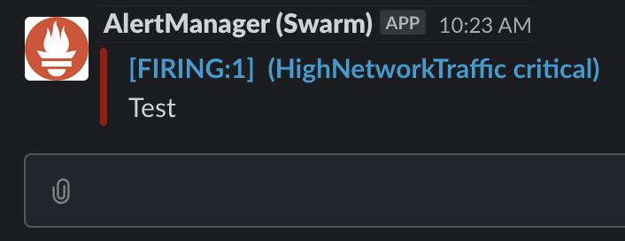

# Getting Started with Prometheus

In this tutorial we will use the following components:

|   Component   | Description                                                                                                                                                                                                                                                                                 |
|:-------------:|---------------------------------------------------------------------------------------------------------------------------------------------------------------------------------------------------------------------------------------------------------------------------------------------|
| Node Exporter | Prometheus exporter for hardware and OS metrics exposed by *NIX kernels.                                                                                                                                                                     |
| Prometheus    | Open-source systems monitoring and alerting toolkit                                                                                                                                                                                                                                         |
| AlertManager  | The Alertmanager handles alerts sent by client applications such as the Prometheus server. It takes care of deduplicating, grouping, and routing them to the correct receiver integrations such as email, PagerDuty, or OpsGenie. It also takes care of silencing and inhibition of alerts. |

## Exploring Prometheus

### Downloading and Running Node Exporter
Download the latest stable release of the Node Exporter for your operation system from the [downloads page](https://prometheus.io/download/#node_exporter). Then extract and run it:

```bash
tar xvfz node_exporter-*.tar.gz
cd node_exporter-*
./node_exporter
```

Now if you visit `http://localhost:9100/metrics` in your browser, you can see that node metrics are available and ready to scraped.

### Downloading and Running Prometheus

Download the latest stable release of the Prometheus for your operation system from the [downloads page](https://prometheus.io/download/#node_exporter). Then extract it:

```bash
tar xvfz prometheus-*.tar.gz
cd prometheus-*
```

By defult Prometheus is configured to monitor itself. We can update this configuration by editing the `prometheus.yml` file. We can tell Prometheus to scrape the metrics that is generated by the node exporter with the following config:

```
- job_name: 'node-exporter'

    # metrics_path defaults to '/metrics'
    # scheme defaults to 'http'.

    static_configs:
    - targets: ['localhost:9100']
```

Start the prometheus instance with the following command:

```bash
./prometheus --config.file=prometheus.yml
```

Prometheus expression browser will be available at `http://localhost:9090/graph`.

### Executing Example Queries

|                      Metric                     | Meaning                                                                                            |
|:-----------------------------------------------:|----------------------------------------------------------------------------------------------------|
| rate(node_cpu_seconds_total{mode="system"}[1m]) | The average amount of CPU time spent in system mode, per second, over the last minute (in seconds) |
| node_filesystem_avail_bytes                     | The filesystem space available to non-root users (in bytes)                                        |
| rate(node_network_receive_bytes_total[1m])      | The average network traffic received, per second, over the last minute (in bytes)                  |
| (1 - avg(irate(node_cpu_seconds_total{mode="idle"}[10s])) by (instance))      | Current CPU usage of the system                  |


## Alerting

### Downloading and Running AlertManager

Download the latest stable release of the AlertManager for your operation system from the [downloads page](https://prometheus.io/download/#alertmanager). Then extract it:

```bash
tar xvfz alertmanager-*.tar.gz
cd alertmanager-*
```

We can configure AlertManager to route the alerts to the Slack by creating a file called `alertmanager.yml` with the following content:

```
route:
    receiver: 'slack'

receivers:
    - name: 'slack'
      slack_configs:
          - send_resolved: true
            channel: '#swarm-prometheus-alerts'
            text: "Alert"
            api_url: https://hooks.slack.com/services/<omitted>/<omitted>/<omitted>
```

Start the AlertManager instance with the following command:

```bash
./alertmanager --config.file=alertmanager.yml
```

From now on AlertManager will receive the alerts from Prometheus and send them to the Slack channel that we specified.

### Declaring Alert Rules for Prometheus

In order to declare some alert rules, we can create a file that is called as `rules.yml` inside the Prometheus directory with the following content:

```
groups:
- name: meta
  rules:
    - alert: HighNetworkTraffic
      expr: sum(rate(node_network_receive_bytes_total[1m])) > 100
      labels:
        severity: critical
      annotations:
        description: The average network traffic received, per second, over the last minute is higher than 100 bytes
        summary: Alerting HighNetworkTraffic
    - alert: HighCPULoad
      expr: (1 - avg(irate(node_cpu_seconds_total{mode="idle"}[10s])) by (instance)) * 100 > 20
      labels:
        severity: critical
      annotations:
        description: Current CPU usage of the system is over 20 percent
        summary: Alerting HighCPULoad
```

An alternative alert config:

```
groups:
- name: meta
  rules:
    - alert: HighNetworkTraffic
      expr: (1 - avg(irate(node_cpu_seconds_total{mode="idle"}[10m])) by (instance)) * 100 > 20
      labels:
        severity: critical
      annotations:
        description: The average network traffic received, per second, over the last minute is higher than 100 bytes
        summary: Alerting HighNetworkTraffic

```
Also we need to say the address of the AlertManager to the Prometheus in order to push alerts to it. To do that, we need to add the following content to the config file of the Prometheus `prometheus.yml`:

```
alerting:
  alertmanagers:
  - static_configs:
    - targets:
      - localhost:9093
```

And since we changed the config of the Prometheus server, we need to restart it:

```bash
./prometheus --config.file=prometheus.yml
```

A few moments later we should receive something like the following:


